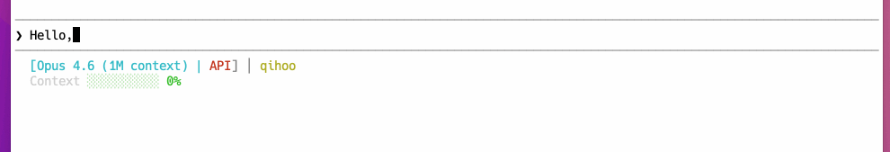

# cc-spinner

[English](README.md) | [中文](README.zh-CN.md)

 [![npm]](https://www.npmjs.com/package/@handoing/cc-spinner)

`cc-spinner` は、Claude Code の spinner verbs（読み込み時の動詞文言）を設定するための CLI ツールです。

内蔵テーマ、内蔵言語パック、またはカスタム JSON ファイルを使って、Claude Code の読み込み文言をすばやく切り替えられます。



> **注意：** このツールは Claude Code バージョン **v2.1.22** 以降をサポートしています。

## SKILL での使用

```bash
npx skills add https://github.com/handoing/cc-spinner
```


## npx での使用

```bash
npx @handoing/cc-spinner setup
```

## 主な機能

- 1 コマンドで Claude Code の spinner verbs を設定
- 内蔵テーマプリセットと言語プリセットをサポート
- カスタム JSON 設定ファイルをサポート
- ターミナルで内蔵テーマを一覧表示し、対話的に選択可能
- 必要に応じて spinner verbs 設定をクリア可能
- Claude Code の設定ファイルへ自動書き込み

## インストール

npm でグローバルインストール：

```bash
npm install -g @handoing/cc-spinner
```

または `npx` で直接実行：

```bash
npx @handoing/cc-spinner <command>
```

## 使い方

### バージョン表示

```bash
cc-spinner --version
cc-spinner -V
```

### spinner verbs を設定する

`setup` コマンドで、テーマ・言語・カスタム JSON ファイルパスを適用します。

```bash
cc-spinner setup [name]
```

例：

```bash
cc-spinner setup
cc-spinner setup default
cc-spinner setup emoji
cc-spinner setup zh-CN
cc-spinner setup ./my-spinner.json
```

動作概要：

- `[name]` を省略した場合は `default` テーマを使用。
- まず内蔵テーマディレクトリを検索。
- 見つからなければ内蔵言語ディレクトリを検索。
- それでも見つからなければ内蔵 `default` テーマにフォールバック。
- 相対/絶対パスが指定された場合は、その JSON ファイルを直接読み込み。

### テーマを一覧表示して対話的に選択する

`list` コマンドで内蔵テーマを一覧表示します。各テーマにはランダムな spinner verb のサンプルが表示されます。
`Enter` を押すとデフォルトで最初のテーマが選択されます。番号を入力して `Enter` を押すと対応するテーマが選択されます。

```bash
cc-spinner list
```

### spinner verbs をクリアする

`clear` コマンドで現在の spinner verbs 設定を空リストに置き換えます。

```bash
cc-spinner clear
```

## 内蔵プリセット

### テーマ

内蔵テーマファイルは [`theme/`](theme/) にあります：

- [`animal`](theme/animal.json)
- [`default`](theme/default.json)
- [`dirty`](theme/dirty.json)
- [`emo`](theme/emo.json)
- [`emoji`](theme/emoji.json)
- [`movies`](theme/movies.json)
- [`philosophy`](theme/philosophy.json)
- [`travel`](theme/travel.json)

### 言語

内蔵言語ファイルは [`language/`](language/) にあります：

- [`en-US`](language/en-US.json)
- [`zh-CN`](language/zh-CN.json)
- [`ja-JP`](language/ja-JP.json)

## 実装概要

CLI のエントリーポイントは [`bin/cc-spinner.js`](bin/cc-spinner.js) で、次の 3 つの主要コマンドを提供します：

- `setup`：[`setup()`](src/commands/setup.js#L3) で実装
- `list`：[`list()`](src/commands/list.js#L4) で実装
- `clear`：[`clear()`](src/commands/clear.js#L3) で実装

設定の解決と書き込みロジックは以下にあります：

- [`resolveSpinnerVerbsData()`](src/utils.js#L33)
- [`updateSettings()`](src/utils.js#L69)

テーマ一覧と対話的選択ロジックは以下にあります：

- [`listThemeNames()`](src/utils.js#L88)
- [`promptSingleSelect()`](src/utils.js#L116)

ツールが書き込む Claude Code 設定パスは [`SETTINGS_PATH`](src/constants.js#L4) で定義され、実体は次の通りです：

```text
~/.claude/settings.json
```

## カスタム JSON 形式

`cc-spinner setup` でカスタムファイルを使う場合、JSON には `spinnerVerbs` フィールドが必要です。

例：

```json
{
  "spinnerVerbs": {
    "mode": "replace",
    "verbs": [
      "loading",
      "thinking",
      "preparing"
    ]
  }
}
```

## プロジェクト構成

```text
.
├── bin/
│   └── cc-spinner.js
├── language/
│   ├── en-US.json
│   ├── ja-JP.json
│   └── zh-CN.json
├── src/
│   ├── commands/
│   │   ├── clear.js
│   │   ├── list.js
│   │   └── setup.js
│   ├── constants.js
│   └── utils.js
├── theme/
│   ├── animal.json
│   ├── default.json
│   ├── dirty.json
│   ├── emo.json
│   ├── emoji.json
│   ├── movies.json
│   ├── philosophy.json
│   └── travel.json
└── package.json
```

## 開発情報

- パッケージ名：`@handoing/cc-spinner`
- 現在のバージョン：`1.1.2`
- CLI 依存：`commander`
- ライセンス情報は [`package.json`](package.json) に記載

## ライセンス

本プロジェクトは ISC License の下で公開されています。詳細は [LICENSE](LICENSE) を参照してください。

[npm]: https://img.shields.io/npm/v/@handoing/cc-spinner.svg?style=flat-square