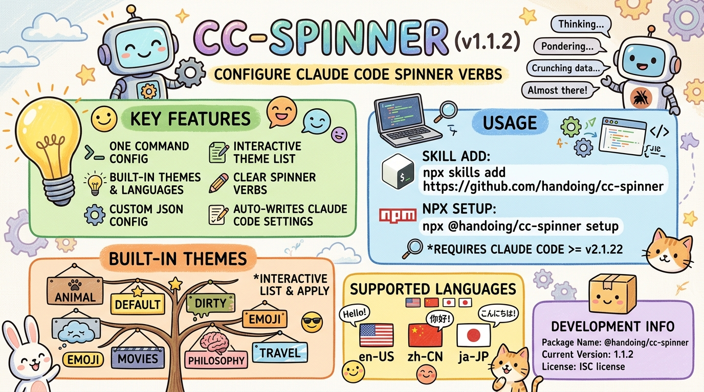

# cc-spinner

[中文文档](README.zh-CN.md) | [日本語](README.ja-JP.md)

 [![npm]](https://www.npmjs.com/package/@handoing/cc-spinner)



<strong>cc-spinner</strong> is a CLI tool for configuring spinner verbs for Claude Code.

It allows you to quickly switch the loading verb set used by Claude Code with built-in themes, built-in language packs, or a custom JSON file.


> **Note:** This tool requires Claude Code version **v2.1.22** or higher.

## Use via SKILL

```bash
npx skills add https://github.com/handoing/cc-spinner
```

## Use via npx

```bash
npx @handoing/cc-spinner setup
```

## Features

- Configure Claude Code spinner verbs with a single command
- Support built-in theme presets and language presets
- Support custom JSON configuration files
- List built-in themes and interactively select one in terminal
- Reset spinner verbs configuration when needed
- Automatically write configuration into Claude Code settings

## Installation

Install globally with npm:

```bash
npm install -g @handoing/cc-spinner
```

Or run it directly with `npx`:

```bash
npx @handoing/cc-spinner <command>
```

## Usage

### Show version

```bash
cc-spinner --version
cc-spinner -V
```

### Setup spinner verbs

Use the `setup` command to apply a preset theme, a preset language, or a custom JSON file path.

```bash
cc-spinner setup [name]
```

Examples:

```bash
cc-spinner setup
cc-spinner setup default
cc-spinner setup emoji
cc-spinner setup zh-CN
cc-spinner setup ./my-spinner.json
```

Behavior summary:

- If `[name]` is omitted, the tool uses the `default` theme.
- It first searches in the built-in theme directory.
- If not found, it searches in the built-in language directory.
- If still not found, it falls back to the built-in `default` theme.
- If a relative or absolute path is provided, it loads that JSON file directly.

### List and select theme interactively

Use the `list` command to display all built-in themes, each with a random example spinner verb.
Press `Enter` to select the first theme by default, or input the index number and press `Enter`.

```bash
cc-spinner list
```

### Clear spinner verbs

Use the `clear` command to replace the current spinner verb configuration with an empty verb list.

```bash
cc-spinner clear
```

## Built-in presets

### Themes

Built-in theme files are stored in [`theme/`](theme/):

- [`animal`](theme/animal.json)
- [`default`](theme/default.json)
- [`dirty`](theme/dirty.json)
- [`emo`](theme/emo.json)
- [`emoji`](theme/emoji.json)
- [`movies`](theme/movies.json)
- [`philosophy`](theme/philosophy.json)
- [`travel`](theme/travel.json)

### Languages

Built-in language files are stored in [`language/`](language/):

- [`en-US`](language/en-US.json)
- [`zh-CN`](language/zh-CN.json)
- [`ja-JP`](language/ja-JP.json)

## How it works

The CLI entry point is [`bin/cc-spinner.js`](bin/cc-spinner.js). It provides three commands:

- `setup`: implemented in [`setup()`](src/commands/setup.js#L3)
- `list`: implemented in [`list()`](src/commands/list.js#L4)
- `clear`: implemented in [`clear()`](src/commands/clear.js#L3)

Configuration resolution and settings updates are handled in:

- [`resolveSpinnerVerbsData()`](src/utils.js#L33)
- [`updateSettings()`](src/utils.js#L69)

Theme listing and interactive selection are handled in:

- [`listThemeNames()`](src/utils.js#L88)
- [`promptSingleSelect()`](src/utils.js#L116)

The tool writes to Claude Code settings at [`SETTINGS_PATH`](src/constants.js#L4), which resolves to:

```text
~/.claude/settings.json
```

## Custom JSON format

When using a custom file path with `cc-spinner setup`, the JSON file should contain a `spinnerVerbs` field.

Example:

```json
{
  "spinnerVerbs": {
    "mode": "replace",
    "verbs": [
      "loading",
      "thinking",
      "preparing"
    ]
  }
}
```

## Project structure

```text
.
├── bin/
│   └── cc-spinner.js
├── language/
│   ├── en-US.json
│   ├── ja-JP.json
│   └── zh-CN.json
├── src/
│   ├── commands/
│   │   ├── clear.js
│   │   ├── list.js
│   │   └── setup.js
│   ├── constants.js
│   └── utils.js
├── theme/
│   ├── animal.json
│   ├── default.json
│   ├── dirty.json
│   ├── emo.json
│   ├── emoji.json
│   ├── movies.json
│   ├── philosophy.json
│   └── travel.json
└── package.json
```

## Development notes

- Package name: `@handoing/cc-spinner`
- Current version: `1.1.2`
- CLI framework: `commander`
- License declared in [`package.json`](package.json)

## License

This project is licensed under the ISC License. See [LICENSE](LICENSE).

[npm]: https://img.shields.io/npm/v/@handoing/cc-spinner.svg?style=flat-square
